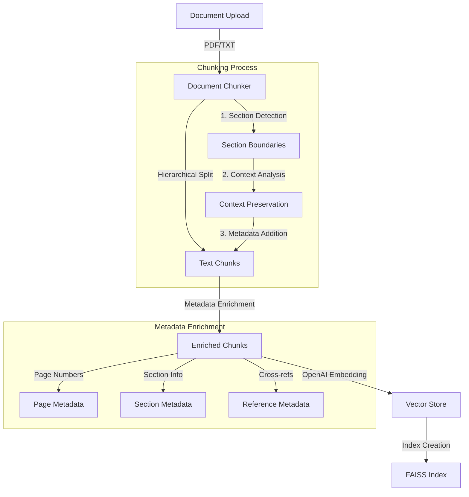
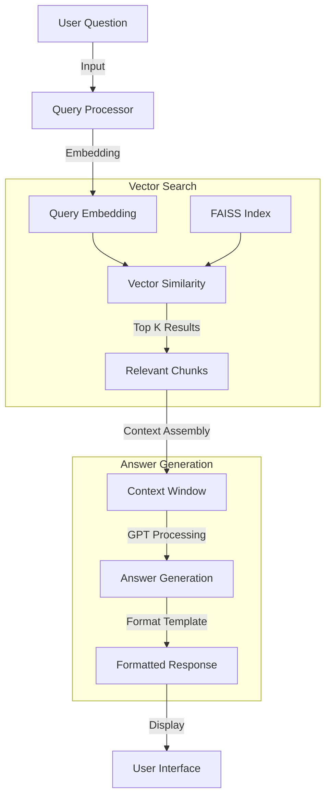

# Document Analysis AI - System Architecture

## 1. System Overview

The Document Analysis AI is a sophisticated question-answering system designed specifically for analyzing tender documents, RFPs, and technical specifications. The system employs a hybrid approach combining hierarchical document chunking, vector-based semantic search, and context-aware question answering.

## 2. Core Components

### 2.1 Document Processing Layer
- **DocumentChunker** (`document_qa.py`)
  - Implements hybrid chunking strategy
  - Handles hierarchical section-based splitting
  - Preserves document structure and context
  - Features:
    - Smart boundary detection
    - Metadata enrichment
    - Cross-reference preservation
    - Context validation

### 2.2 Vector Storage Layer
- **VectorStore** (`vector_store.py`)
  - Core vector database implementation
  - Manages document embeddings
  - Handles similarity search
  - Components:
    - FAISS vector store
    - OpenAI embeddings
    - QA chain integration
    - Context filtering

### 2.3 Web Interface
- **Streamlit App** (`app.py`)
  - User interface and interaction
  - Document upload handling
  - Question input processing
  - Answer visualization
  - Source citation display

## 3. Data Flow

### 3.1 Document Processing Flow


### 3.2 Query Processing Flow


### 3.3 Data Transformations

#### Document Processing
1. **Initial Upload**
   - Input: Raw document (PDF/TXT)
   - Output: Plain text with preserved formatting

2. **Chunking**
   - Input: Document text
   - Process:
     - Section boundary detection
     - Hierarchical splitting
     - Context preservation
   - Output: List of chunks with structural metadata

3. **Metadata Enrichment**
   - Input: Raw chunks
   - Added metadata:
     ```json
     {
       "page": "page_number",
       "section": "section_title",
       "section_type": "requirement|general|specification",
       "has_numerical_values": boolean,
       "has_clause_references": boolean
     }
     ```
   - Output: Enriched chunks with metadata

4. **Vector Embedding**
   - Input: Enriched chunks
   - Process:
     - OpenAI ada-002 embedding
     - 1536-dimensional vectors
     - Normalized for cosine similarity
   - Output: Vector representations

#### Query Processing
1. **Query Analysis**
   - Input: User question
   - Process:
     - Intent classification
     - Entity extraction
     - Context requirement analysis
   - Output: Processed query

2. **Context Retrieval**
   - Input: Query embedding
   - Process:
     - k-NN search (k=6)
     - Relevance scoring
     - Context filtering
   - Output: Relevant document chunks

3. **Answer Generation**
   - Input: 
     - Question
     - Retrieved contexts
     - FAQ template
   - Process:
     - Context merging
     - GPT-3.5-turbo processing
     - Citation extraction
   - Output: Formatted answer with sources

### 3.4 Data Quality Checks

1. **Chunk Validation**
   ```python
   # Minimum requirements
   - Content length > 10 words
   - Complete sentences
   - Preserved semantic units
   ```

2. **Context Relevance**
   ```python
   # Relevance criteria
   - Term overlap score > 0.3
   - Required metadata present
   - Numerical/temporal match if needed
   ```

3. **Answer Validation**
   ```python
   # Quality checks
   - Source citations present
   - Format compliance
   - Cross-reference validity
   ```

### 3.5 Error Handling Points
- Document upload failures
- Chunking boundary errors
- Embedding API failures
- Vector store indexing issues
- Context retrieval timeouts
- Answer generation failures

## 4. Key Technologies

### 4.1 Core Framework
- LangChain: Document processing and QA chains
- FAISS: Vector similarity search
- OpenAI: Embeddings and LLM
- Streamlit: Web interface

### 4.2 Supporting Libraries
- spaCy: NLP processing
- TextBlob: Text analysis
- NLTK: Language processing
- scikit-learn: Machine learning utilities

## 5. Implementation Details

### 5.1 Document Chunking Strategy
```python
# Maximum chunk size: 1000 tokens
# Overlap: 100 tokens
# Hierarchical structure preservation
# Metadata enrichment for each chunk
```

### 5.2 Vector Store Configuration
```python
# Embedding model: text-embedding-ada-002
# Chunk processing batch size: 1000
# Similarity search config:
#   - k: 6 (nearest neighbors)
#   - fetch_k: 10 (candidates)
#   - score_threshold: 0.5
```

### 5.3 QA Chain Configuration
```python
# Model: gpt-3.5-turbo-16k
# Temperature: 0.0 (deterministic)
# Max tokens: 10,000
# Custom FAQ format prompt
```

## 6. Storage Systems

### 6.1 Primary Storage
- FAISS for vector embeddings
- Local file system for document cache
- Session state for web interface

### 6.2 Optional Storage
- MongoDB integration available
- Local vector store implementation
- Persistent index storage

## 7. Quality Assurance

### 7.1 Context Validation
- Relevance scoring
- Numerical value verification
- Temporal information checking
- Metadata validation

### 7.2 Answer Format
- Structured FAQ format
- Source citations
- Cross-references
- Page and clause tracking

## 8. Performance Optimizations

### 8.1 Vector Store
- Aggressive caching
- Batch processing
- Normalized vectors
- Optimized similarity search

### 8.2 Document Processing
- Smart chunking
- Efficient metadata handling
- Cached embeddings
- Parallel processing support

## 9. Security Considerations

### 9.1 API Security
- Environment-based API key management
- Secure file handling
- Temporary file cleanup
- Access control

### 9.2 Data Privacy
- Local processing
- No permanent storage
- Secure file uploads
- Session isolation

## 10. Future Enhancements

### 10.1 Planned Features
- Multi-document comparison
- Advanced pattern matching
- Interactive visualization
- Batch processing support

### 10.2 Scalability
- Distributed vector storage
- Load balancing
- Caching improvements
- Performance monitoring

## 11. Dependencies

```plaintext
faiss-cpu==1.7.4
numpy>=1.21.0
langchain>=0.1.0
langchain-openai>=0.0.2
openai>=1.3.0
tiktoken>=0.5.2
python-dotenv>=1.0.0
spacy>=3.7.2
streamlit>=1.32.0
scikit-learn>=1.4.0
nltk>=3.8.1
textblob>=0.17.1
pymongo>=4.6.0
langchain-community>=0.0.21
```

## 12. Directory Structure

```
document_analysis/
├── src/                    # Source code
│   ├── core/              # Core functionality
│   │   ├── __init__.py
│   │   ├── document_qa.py     # Document processing and chunking
│   │   ├── vector_store.py    # Vector storage and retrieval
│   │   └── pattern_store.py   # Pattern matching utilities
│   │
│   ├── api/               # API endpoints
│   │   ├── __init__.py
│   │   └── routes.py      # API routes
│   │
│   ├── utils/             # Utility functions
│   │   ├── __init__.py
│   │   ├── text_utils.py  # Text processing utilities
│   │   └── file_utils.py  # File handling utilities
│   │
│   └── web/               # Web interface
│       ├── __init__.py
│       ├── app.py         # Main Streamlit application
│       └── components/    # UI components
│
├── config/                # Configuration files
│   ├── __init__.py
│   ├── settings.py       # Application settings
│   └── patterns.json     # Pattern matching rules
│
├── data/                  # Data files
│   ├── samples/          # Sample documents
│   │   ├── sample.txt
│   │   └── sample_document.txt
│   └── cache/            # Cache directory
│
├── docs/                  # Documentation
│   ├── ARCHITECTURE.md   # System architecture
│   ├── qa_context.md     # QA context guide
│   ├── qa_responses.md   # Response formats
│   └── rfp_analysis.md   # RFP analysis guide
│
├── tests/                 # Test files
│   ├── __init__.py
│   ├── test_document_qa.py
│   ├── test_vector_store.py
│   └── test_pattern_store.py
│
├── .env                   # Environment variables
├── .gitignore            # Git ignore file
├── README.md             # Project overview
└── requirements.txt       # Project dependencies
```

## 13. Error Handling

### 13.1 Document Processing
- Invalid file formats
- Chunking failures
- Embedding errors
- Context validation

### 13.2 Query Processing
- Invalid questions
- Context retrieval failures
- Answer generation errors
- Source citation issues

## 14. Monitoring and Logging

### 14.1 User Interface
- Document processing status
- Query processing feedback
- Error notifications
- Performance metrics

### 14.2 System Health
- Vector store status
- API connectivity
- Resource utilization
- Error tracking

## 15. Deployment

### 15.1 Requirements
- Python 3.8+
- OpenAI API access
- Sufficient RAM for FAISS
- Storage for documents

### 15.2 Configuration
- Environment variables
- API keys
- Storage paths
- Processing parameters
