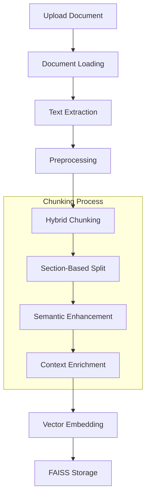

# RFP Analysis System

An advanced system for analyzing Request for Proposal (RFP) and tender documents using AI and NLP technologies.

## 🏗️ Project Structure

### Current Components

```
RFP-Analysis-System/
├── 📄 app.py                    # Streamlit web interface
├── 📄 document_qa.py            # Document processing and QA logic
├── 📄 vector_store.py           # Vector storage implementations (FAISS)
├── 📄 pattern_store.py          # Pattern matching and extraction
├── 📄 patterns.json             # Predefined patterns for extraction
├── 📄 requirements.txt          # Project dependencies
├── 📄 .env                      # Environment configuration
├── 📄 qa_responses.md           # Response templates
├── 📁 __pycache__/             # Python cache directory
└── 📄 Data Files
    ├── DCA_formatted.txt       # Document Control Agreement
    ├── RFP_formatted.txt       # Request for Proposal
    ├── sample.txt             # Sample test document
    └── sample_document.txt    # Sample test document

```

## 🔑 Key Components

### 1. Document Processing (`document_qa.py`)
- **DocumentChunker Class**
  - Implements hybrid chunking strategy
  - Hierarchical section-based chunking
  - Semantic enhancement layer
  - Context enrichment with metadata
  - Special handling for definitions and tables
  - Chunk size optimization (1000 tokens max)

### 2. Vector Storage (`vector_store.py`)
- **VectorStore Class**
  - FAISS integration for similarity search
  - OpenAI embeddings integration
  - Advanced QA chain setup
  - Response formatting
  - N/A filtering
  
- **LocalVectorStore Class**
  - Local vector storage implementation
  - Cosine similarity search
  - Metadata management
  
- **MongoVectorStore Class**
  - MongoDB-based vector storage
  - Distributed storage capability
  - Index management

### 3. Pattern Management (`pattern_store.py`)
- **Pattern extraction and matching**
  - Technical requirement patterns
  - Financial requirement patterns
  - Legal clause patterns
  - Cross-reference handling

### 4. Web Interface (`app.py`)
- **Streamlit Application**
  - Document upload interface
  - Interactive Q&A system
  - Result visualization
  - Document processing status
  - Sample question suggestions

### 5. Configuration
- **Environment Setup (.env)**
  - API keys management
  - Model configurations
  - System settings

### 6. Data Management
- **Pattern Definitions (patterns.json)**
  - Predefined extraction patterns
  - Regular expressions
  - Entity definitions
  
- **Response Templates (qa_responses.md)**
  - Standard response formats
  - Answer templates
  - Citation formats

## 🛠️ Technical Implementation

### Vector Store Integration
- FAISS for efficient similarity search
- Pinecone for distributed vector storage
- MongoDB for metadata and document storage

### LLM Integration
- OpenAI GPT models for text analysis
- Custom prompt engineering
- Context window optimization
- Response formatting

### Document Structure Handling
- Hierarchical parsing
- Cross-reference management
- Table and list preservation
- Metadata enrichment

## 📊 Data Flow

1. **Document Ingestion**
   ```
   Upload → OCR/Text Extraction → Preprocessing → Chunking
   ```

2. **Analysis Pipeline**
   ```
   Chunks → Embedding → Vector Storage → Query Processing → Response Generation
   ```

3. **Quality Assurance**
   ```
   Response → Validation → Cross-reference Check → Format Check → Final Output
   ```

## 🔧 Configuration

### Chunking Settings
- Maximum chunk size: 1000 tokens
- Overlap: 100 tokens
- Minimum: Complete semantic unit
- Hierarchical boundaries: Parts, Articles, Sections

### Vector Store Settings
- Dimension: 768 (default)
- Similarity metric: Cosine
- Index type: FAISS IVF
- Batch size: 1000

### LLM Settings
- Model: GPT-3.5-turbo-16k
- Temperature: 0.0 (precise extraction)
- Max tokens: 2000
- Presence/frequency penalty: 0.0

## 🚀 Getting Started

1. **Installation**
   ```bash
   pip install -r requirements.txt
   ```

2. **Environment Setup**
   ```bash
   cp .env.example .env
   # Configure your API keys and settings
   ```

3. **Running the Application**
   ```bash
   streamlit run app.py
   ```

## 📝 Usage Guidelines

1. **Document Preparation**
   - Ensure clean, searchable PDF/text format
   - Verify page numbers and section headers
   - Check table formatting

2. **Query Formation**
   - Be specific with requirements
   - Include relevant section references
   - Use document terminology

3. **Result Interpretation**
   - Verify page number citations
   - Cross-check with source document
   - Review all related clauses

## 🔍 Quality Assurance

- Cross-reference verification
- Answer completeness checking
- Technical accuracy validation
- Format consistency
- Source citation validation

## 🛡️ Security Considerations

- API key protection
- Rate limiting
- Input validation
- Audit logging
- Access control

## 📈 Performance Optimization

- Caching strategies
- Batch processing
- Asynchronous operations
- Query optimization
- Memory management

## 🤝 Contributing

Please read [CONTRIBUTING.md](CONTRIBUTING.md) for details on our code of conduct and the process for submitting pull requests.

## 📄 License

This project is licensed under the MIT License - see the [LICENSE.md](LICENSE.md) file for details.

## 🔄 System Flow

### 1. Document Processing Flow


### 2. Query Processing Flow


### 3. Detailed Component Interaction

```
┌─────────────────┐     ┌─────────────────┐     ┌─────────────────┐
│    app.py       │     │  document_qa.py │     │ vector_store.py │
│  Web Interface  │────▶│    Processor    │────▶│  Vector Store   │
└─────────────────┘     └─────────────────┘     └─────────────────┘
         │                       │                       │
         │                       │                       │
         ▼                       ▼                       ▼
┌─────────────────┐     ┌─────────────────┐     ┌─────────────────┐
│  patterns.json  │     │ pattern_store.py│     │    OpenAI API   │
│    Patterns     │◀───▶│Pattern Matching │     │  Embeddings/LLM │
└─────────────────┘     └─────────────────┘     └─────────────────┘
```

### 4. Data Flow Description

1. **Document Upload & Processing**
   ```
   Document → Text Extraction → Chunking → Embedding → Storage
   ```
   - Upload via Streamlit interface (app.py)
   - Processing in document_qa.py
   - Vector storage in vector_store.py

2. **Query Processing**
   ```
   Query → Pattern Match → Vector Search → Context Retrieval → LLM → Response
   ```
   - Query input through Streamlit
   - Pattern matching using pattern_store.py
   - Vector search in FAISS store
   - LLM processing with OpenAI

3. **Response Generation**
   ```
   Context → Template → Format → Citations → Display
   ```
   - Context assembly from chunks
   - Template application
   - Citation addition
   - Formatting and display

### 5. Key Process Steps

1. **Document Processing**
   - Load document using document_qa.DocumentChunker
   - Apply hybrid chunking strategy
   - Generate embeddings using OpenAI
   - Store in FAISS index

2. **Query Handling**
   - Process user query
   - Match against patterns.json
   - Search vector store
   - Retrieve relevant chunks

3. **Response Assembly**
   - Combine chunk information
   - Apply response templates
   - Add citations and references
   - Format for display

4. **Quality Control**
   - Filter N/A responses
   - Validate citations
   - Check completeness
   - Ensure formatting

### 6. System Integration Points

1. **External APIs**
   ```
   OpenAI API ←→ vector_store.py
   ```
   - Embeddings generation
   - LLM query processing

2. **Storage Integration**
   ```
   FAISS ←→ vector_store.py
   ```
   - Vector storage
   - Similarity search

3. **Pattern Management**
   ```
   patterns.json ←→ pattern_store.py
   ```
   - Pattern definition
   - Pattern matching

4. **User Interface**
   ```
   app.py ←→ All Components
   ```
   - User interaction
   - Result display
